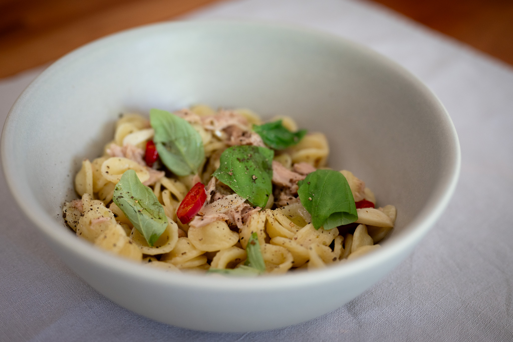
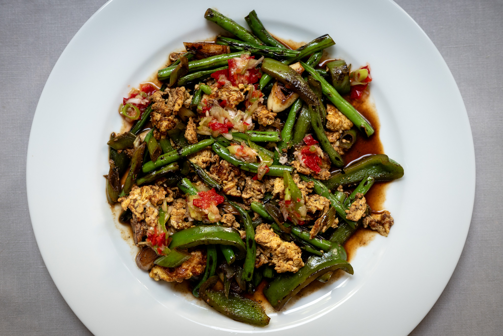
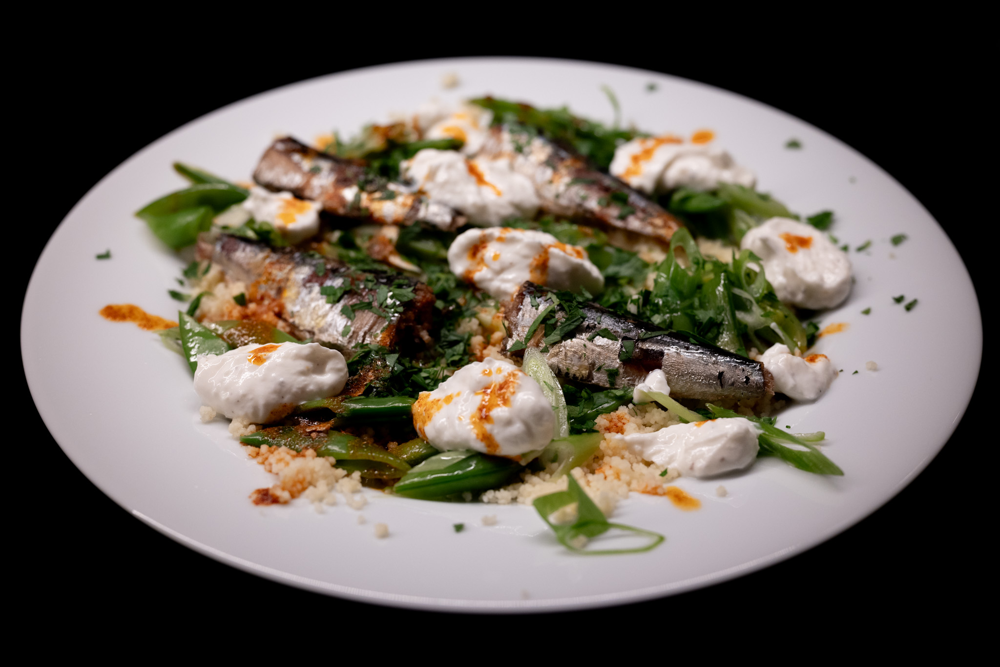
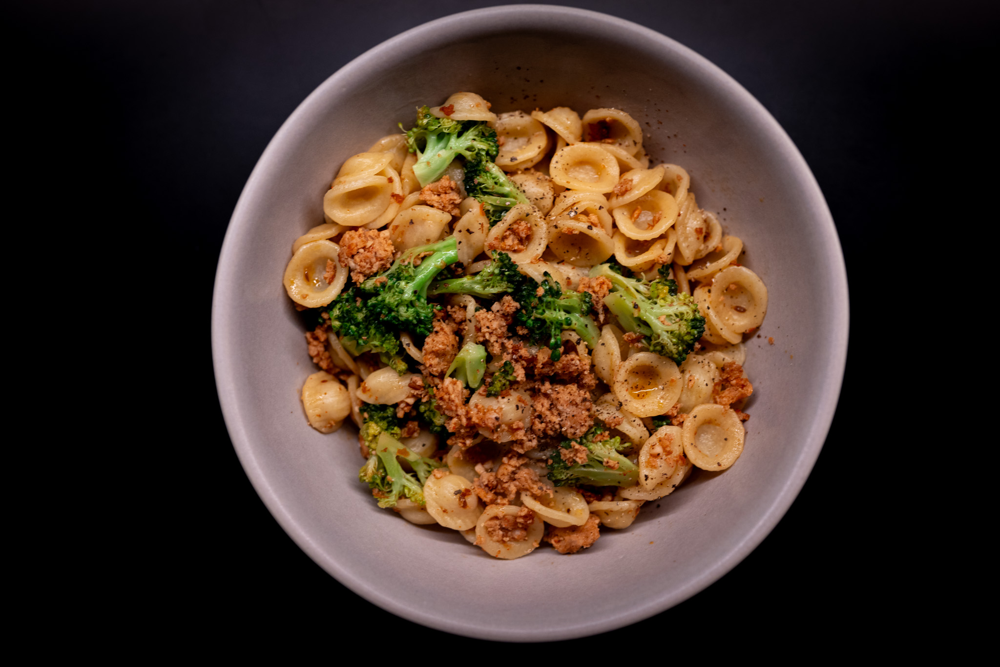
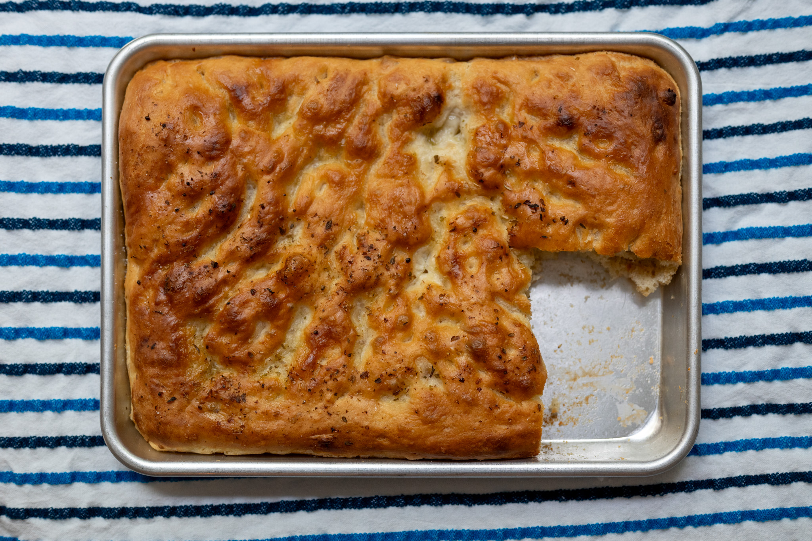
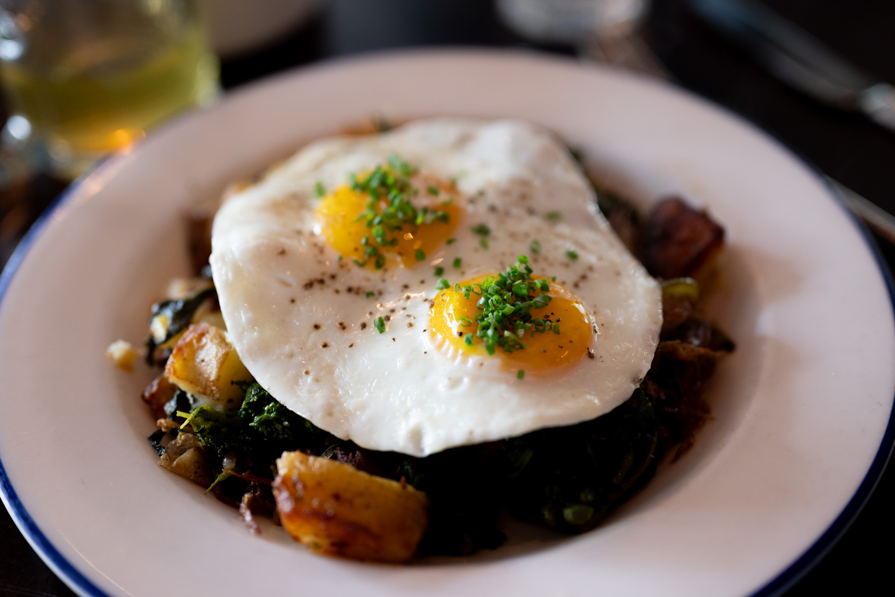
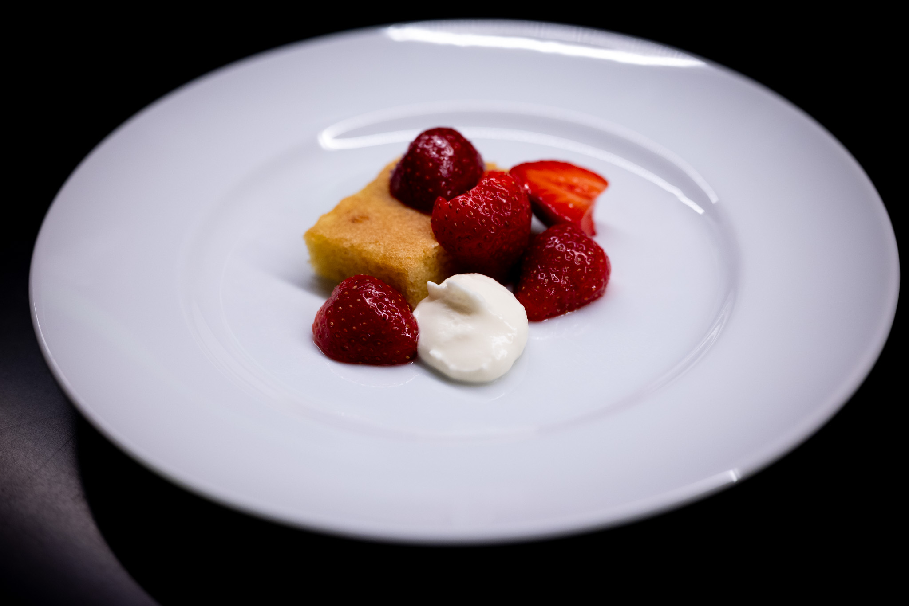

The last of summer was in many ways more of the same.

I continue to be a big fan of the pan bagnat. After doing a bit more research, a lot of people suggested adding a lot of fresh basil, which I thought was a great concept. I may have strayed slightly from tradition by using non-standard bread. But, for next time, I believe the canonical loaf is only a question of shaping and baking my usual _pain courant_ dough a little differently.

Despite my best efforts, I couldn't get a good photo I liked. Suffice to say it was delicious.

I also used the opportunity to try a bunch of different tuna in olive oil. I don't know I had a clear favorite. Certainly, inside a sandwich or something else, I struggled to distinguish between the more mid-range and high-end options. But it sent me down a path experimenting with it as an ingredient. I've become a bit of a convert to doing pasta with it.

On a similar theme, I tried [a couple of ideas](https://www.theguardian.com/food/2023/jul/29/yotam-ottolenghi-30-minute-meal-recipes-mackerel-couscous-stir-fry-fluffy-eggs-daqa-pak-choi) from a recent Ottolenghi column focused on 30-minute meal ideas. The green stir fry was great. I forgot to buy pine nuts and had some red chili to use up. I don't think it suffered too much for that. I'm certainly planning to add it to my repertoire. I served that with the really excellent pita I pick up from one of my regular lunch spots.

It's going to take a few more outings to get all the mechanics down, however. While I got close, I don't think I quite got it done in 30 minutes.

From the same column, I did what wound up being a variation of a smoked mackerel dish. Despite trying a couple different places, I couldn't get my hands on smoked mackerel. (It is perhaps a very British ingredient.) Instead, I continued my exploration of preserved fish and used tinned smoked sardines. It's another oily fish, and even more sustainable. If you can find them, I'd highly recommend the Bela brand.

Channeling my inner Nigella Lawson, I had the need for a few late-night quick dinners. I'm a big fan of doing orechiette with sausage and broccoli. It's incredibly uncouth --- I'm not even remotely pretending this has a connection to Italy or the Italian American traditions --- but I really love doing it with chorizo.

I spent some time exploring more breads, in particular focaccia. Unlike last month's _pide_, I was reasonably happy with the results, with one small caveat. If you've ever made or even eaten focaccia, you'll know that it's got little craters to capture all the olive oil and salt. Which you make by pressing your fingers into the dough before its final rise. Alas, my incredibly skinny fingers didn't quite give the effect I wanted. Not much to be done --- I like my fingers as they are --- but it amused me. And the bread was still delicious.

Outside my kitchen, I happened to have my camera with me for a lunch. I took a chance on a confit duck hash, and it was delicious. Confit duck is usually a good idea, but I think if we're being completely honest, the roast potatoes were the start of the plate.

Over on the pasty side, something took me to experimenting with dainty fine dining-style desserts. I'd say I have a way to go. I'm forcing myself to resist the urge to find an edible flower supplier, buy a set of tweezers for the kitchen, and get some more on-trend plates. Aesthetics aside, I really liked the pairing I came up with: macerated strawberries with a rosewater olive oil cake and lemony crème fraîche.

It must be said that, at home, something about fine dining-size portions doesn't quite work. I'm not above admitting that after devouring the five bites of my invented tasting menu component, I had a few (a lot) more strawberries with cream in a bigger, less dignified bowl.

Next month, I'm trying to keep my mind open. I'll be spending much of it in Scandinavia, and I'm incredibly excited to explore the food scene. There are a few Danish classics in particular I'm eager to try in their place of origin. Of course, the famously unpronounceable _rødgrød med fløde_, and then _smørrebrød_. Both of which, in the right hands, I feel like could be really interesting, in the same way, its bad reputation aside, I've had great British food when it's been given a modern update.

From everything I've heard, the Nordic countries have a really vibrant modern food scene. Which is puzzling to me, given how different the Netherlands felt in comparison to France and Spain when I was in those countries earlier in the year. But I'm not one to look a gift horse in the mouth. I'm incredibly excited to eat through the influence of places like Noma, even if Noma itself is probably outside my budget on this particular trip.

### Experimental: What I'm Reading and Watching

* An [elegy for Le Gavroche](https://www.theguardian.com/food/2023/sep/14/michel-rouxs-le-gavroche-isnt-just-a-restaurant-it-has-been-a-school-for-chefs) from Jay Rayner

* A [predictably underwhelming launch](https://www.nytimes.com/2023/09/13/dining/colorado-restaurants-michelin-stars.html) for the Guide Michelin in the Denver area

* Contemplating [the future of coffee](https://ig.ft.com/coffee/) in the _FT_

* Also in the _FT_, [an excellent Q+A](https://www.ft.com/content/962fb56e-6720-4b65-888f-5d0d2f5e1ad8) with their wine expert, Jancis Robinson

* I'm eagerly awaiting Fuchsia Dunlop's new book, [_Invitation to a Banquet_](https://www.penguin.co.uk/books/443155/invitation-to-a-banquet-by-dunlop-fuchsia/9780241516980)

* On YouTube, [a video profile](https://youtu.be/nQRNbxRMfDQ) of the baker behind one of my favorite bakeries, St Honoré in Portland

_[Subscribe](/subscribe) to get notified every month when new issues go out_