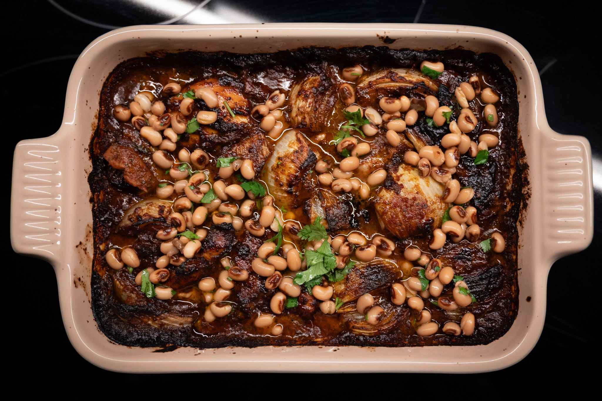
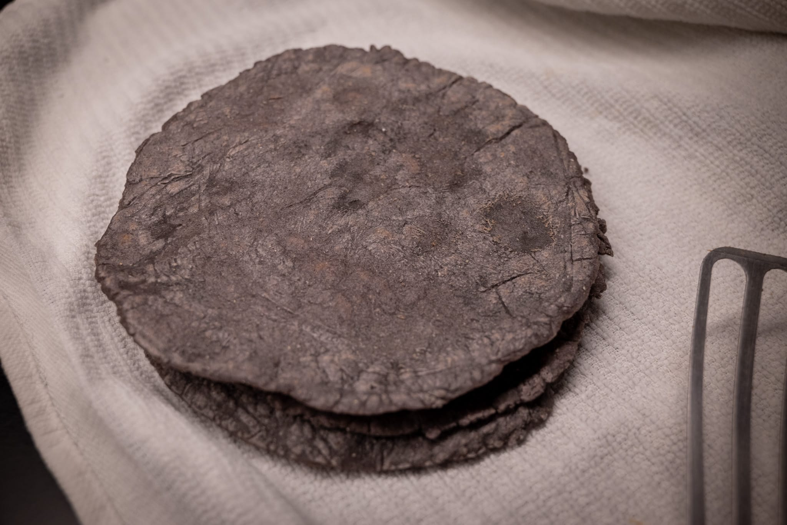
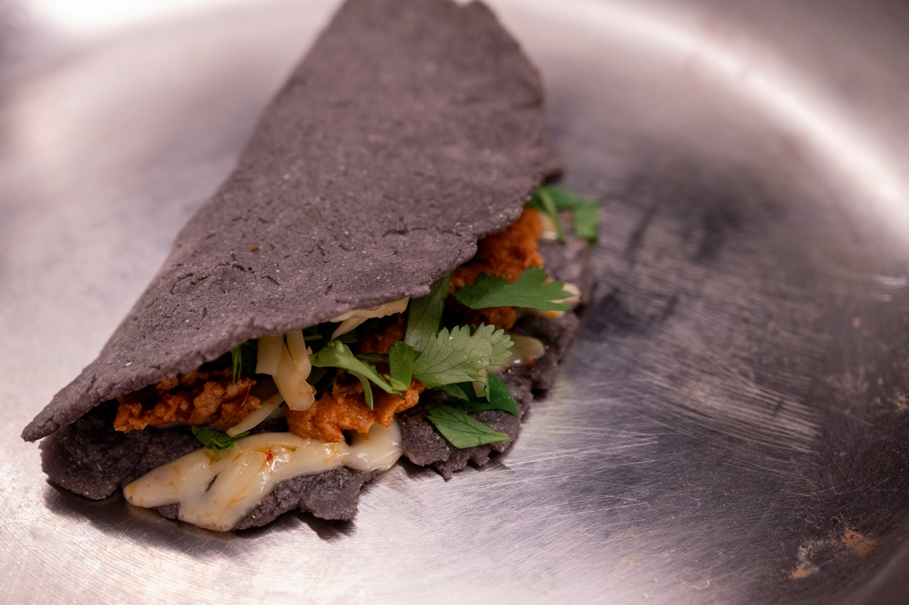
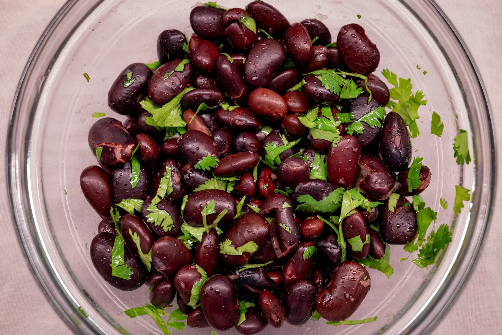
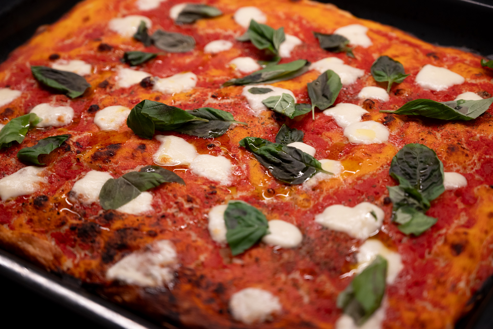
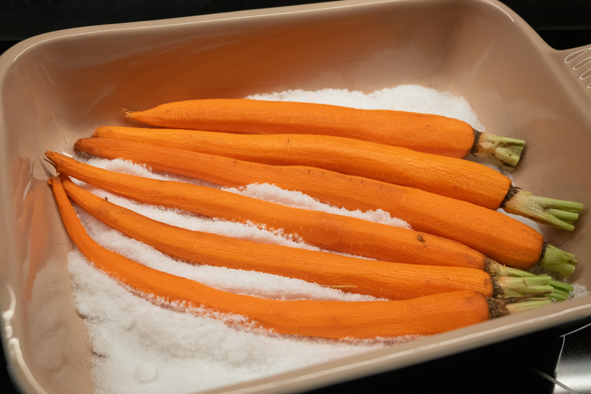
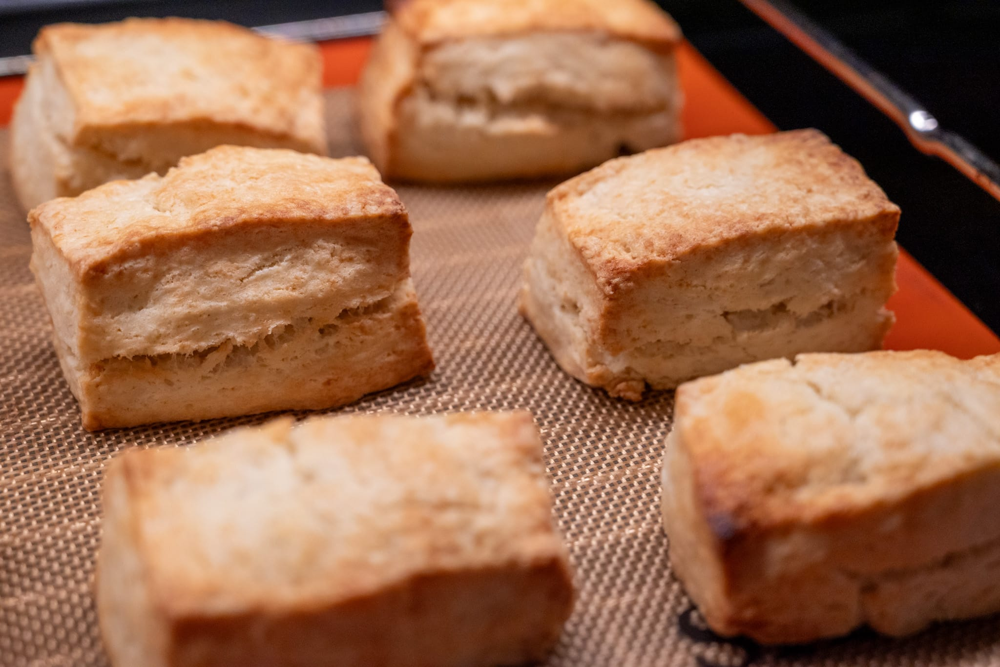

It's been a bit of a lighter month cooking at home for various reasons, but that hasn't completely stopped my various experimentation.

I returned to the great chipotle chicken recipe I got from the Ottolenghi team a few weeks ago. It's a sort of cheat's mole, chocolate included. I'm under no illusions that it's a poor substitute for the real thing. Equally, doing a real, complex mole is beyond my patience and ability to get ingredients. So, for something that comes together reasonably quickly --- the hardest part is remembering to soak the chipotles ahead of time --- it's a great alternative.

It works, per the original recipe, with rice. I also tried it in a taco format. Partly because I wanted some tacos. Partly because I'm on an ongoing quest to perfect my tortilla making skills. Even if it really couldn't hold a candle to a real mole, it was still satisfying. My tortilla making skills are also on the up. It's always a palaver, but so worth it. (The starches in cooked corn tortillas retrograde irreversibly after cooking, which is why you really can't buy great corn tortillas unless you live in Mexico and have a neighborhood tortilla factory that will give them to you so fresh they're still steaming hot.)

Keeping on the Ottolenghi theme, for reasons I'm not quite ready to share here for reasons of operational security, I didn't get a copy of the new book (_Comfort_). An evaluation will have to wait for a month or two.

On the Mexican theme, doing some research on tortilla making led me to a variety of videos and articles about quesadillas. They're something I'd always assumed weren't very Mexican along the lines of the hard-shell tacos from a kit that I ate as a child. My most recent memory of having quesadillas was at a generic restaurant in the terminal of a small airport in North Carolina.

A lot has been lost in translation. In the same way fresh tortillas make for much better tacos, fresh tortillas make better quesadillas. The tortilla and quesadilla are so interlinked, you cook the tortilla at the same time you cook (or at least reheat) the quesadilla filling.

Despite my middling technique --- I'm sure I'll be very embarrassed by that photo a few months from now --- they were still by far the best quesadillas I've ever eaten. It's a jump up in quality that makes them feel like an actual dinner rather than an afterthought.

My revisiting of past projects continued with another couple of runs at the famous (infamous?) pizza _in teglia_. I've really nailed the texture component. I'm pretty pleased at how consistently I can get the fluffy interior and nicely crisped bottom. The trick really is the pan.

I'm still not completely happy with the way I've gotten the toppings to behave. Admittedly, I'm not following the quasi-advice that tradition has to offer. From what I understand, the usual toppings are almost even more minimal than on a Neapolitan-style pizza. But I can't quite bring myself to do a potato pizza. I like the tomato-basil-mozzarella trio, however unoriginal it may be.

My batch of lacto peaches didn't really work, sadly. It's hard to say exactly why. On the surface, I think the ferment worked. There was no mold or obviously off flavors that made me think a different bacterium won the survival-of-the-fittest competition in the vacuum pack. 

But on tasting, the fermented peaches were off. The flavor was not only not good, but actively a bit gross. It's possible I let them ferment too long. But I think there may be a fundamental mismatch between the flavor peaches and the funk from a lacto ferment.

Since fall approaches --- or is already here by the meteorological definition --- I thought it would be interesting to start experimenting for some more fall-winter friendly techniques. I tried salt baking for the first time with some carrots. It didn't work.

I realize salt is pretty abundant and (relatively) cheap. Likewise, I have zero problem doing something more obviously expensive like buying chicken wings solely for the purpose of making a great stock. Even so, using so much salt to cook a handful of carrots felt very wasteful.

The technique also failed to create delicious food. The carrots were under-cooked and inedibly over-seasoned. Not totally crisp like a raw carrot, but also not buttery soft the way I'd get them with my usual roasting technique. So over-seasoned, I couldn't eat more than one test bite. I'm sure some of this is down to execution rather than anything intrinsic to the technique. My first-ever attempt at real bread baking was similarly pretty disastrous. But this is clearly one of those techniques that requires more finesse than the "it's so easy!" recipes I skimmed to try this out.

With what I imagine were the last of the great strawberries, I did yet more shortcake. It was a canvas to experiment. Or really, to be lazy. While there's a part of me that likes the classic round and fluted shortcake, it's a pain to roll the dough out, use and wash an intricate cutter, and then deal with all the scraps. After a few different attempts, I really liked a 20 mm thick block cut into nice rectangles. It's easier and I think looks a little sharper too.

### What's Next

As alluded to last month, I have some fun travel plans coming up. As above, I don't want to say too much here and now for operational security reasons. It should give me a bunch of opportunities to return to some of my favorite places to eat and explore some new ideas.

That probably means I'll miss the last of the great summer produce to cook with at home.

By chance, I found this great video of someone in Brittany making (as he puts it) _the_ kouign amann. I'm not sure the weather will put me in the mood to make something so indulgent --- it may need to wait for Christmas --- but the idea has some appeal. This way of doing it also looks a lot easier than other recipes for kouign amann that I've seen.



I should be able to pick up some fun things to cook with on my travels, however. More on that next month.

### What I'm Reading and Watching

* A great summary of the [benefits of using your dishwasher](https://www.youtube.com/watch?v=SDfeLICMfNc)

* How not to [organize your refrigerator](https://www.theguardian.com/tv-and-radio/article/2024/sep/04/the-fridgerton-effect-the-1820s-inspired-trend-making-fridges-dangerously-glam)

* On his retirement the [outgoing _Times_ food critic Pete Wells reflects](https://www.nytimes.com/2024/08/06/dining/pete-wells-how-restaurants-have-changed.html) on shifts in the restaurant industry

* [Ina Garten profiled](https://www.newyorker.com/magazine/2024/09/09/ina-garten-profile), ahead of the release of her new memoir, in _The New Yorker_

* How a visitor from the United States [got one Brit to change her attitude](https://www.theguardian.com/commentisfree/article/2024/aug/19/american-came-to-stay-changed-my-attitude-water) to water as a beverage

* Coverage of [the new battle for supremacy](https://www.nytimes.com/2024/09/02/business/coffee-wars-arms-race-starbucks.html) in the would-be coffee market

_[Subscribe](/subscribe) to get notified every month when new issues go out_
