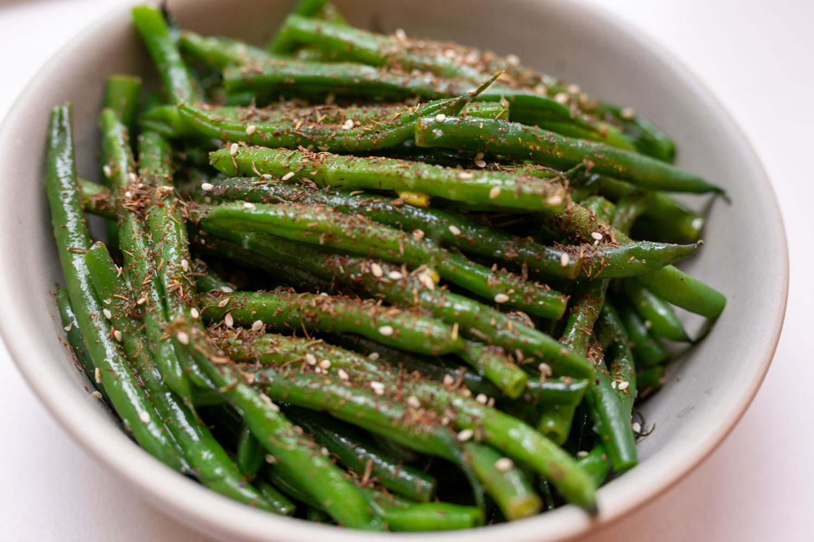
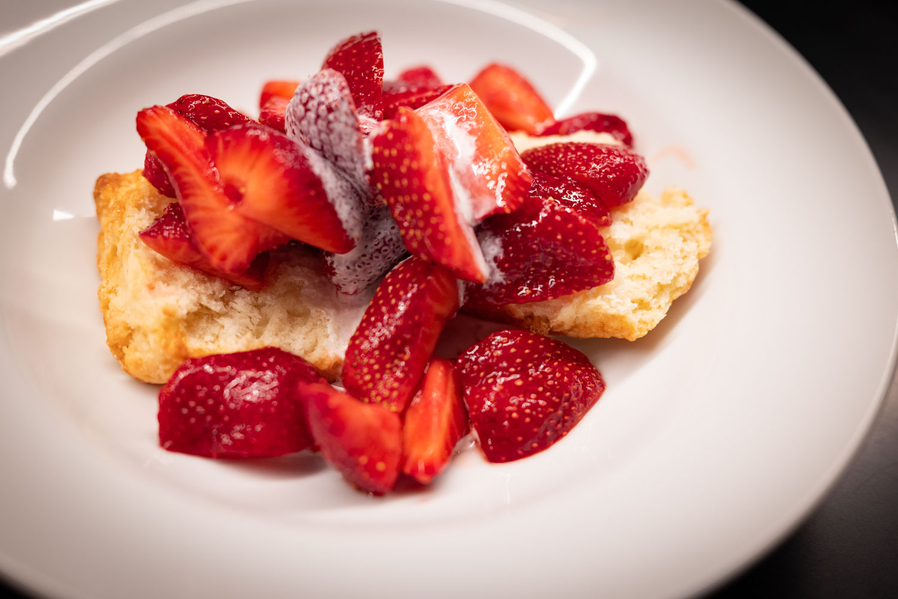
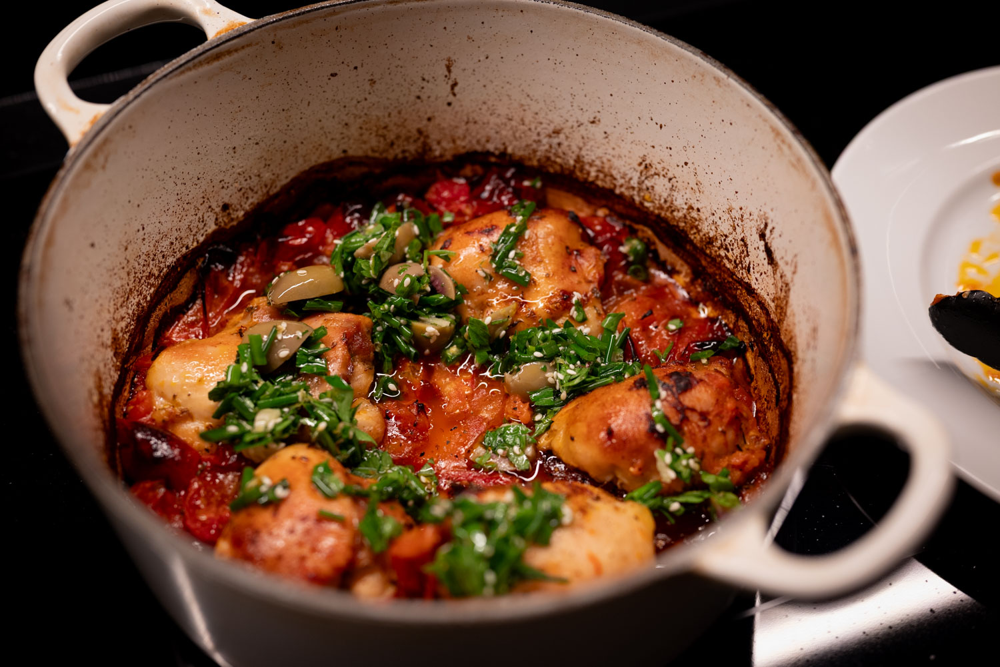
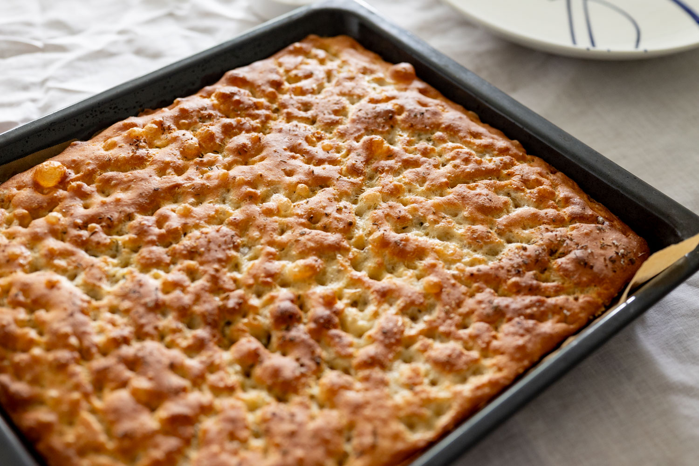
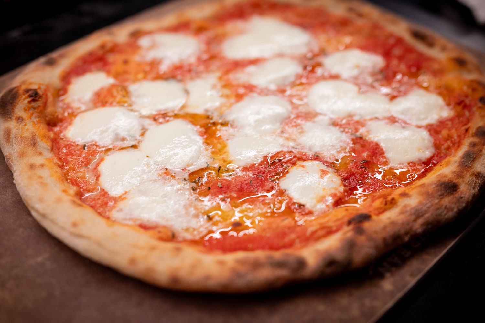
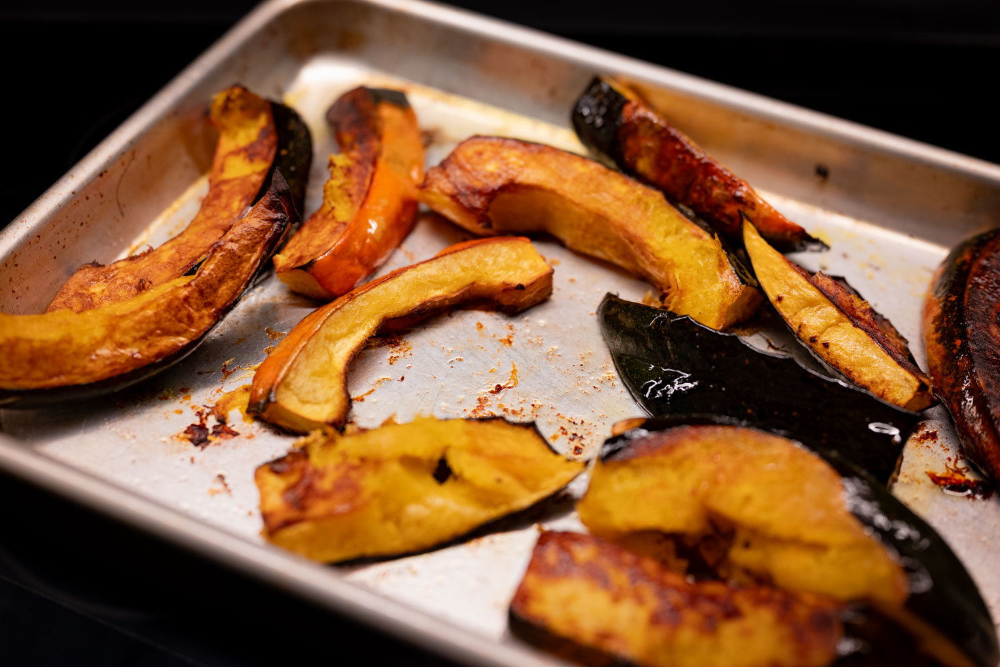
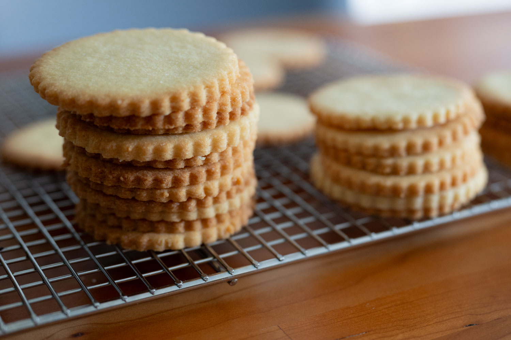

The month has been an interesting almost paradoxical one from a food experimentation perspective. When so many great things are in season, they need so little treatment, I do more assembly than cooking.

I found more great green beans, so did those (in one instance) tossed simply with a garlicky lemony sauce and a dash of za'atar.

I spotted more great strawberries and snapped them up. For at least a few, I made some shortcakes and served them with a dash of cream.

Some application of heat can be helpful. I tried out yet another recipe from the latest Ottolenghi cookbook, and, with one of my own little accidental twists, it turned out really nicely. It also uses in-season tomatoes as a nice bonus.

The first time I made this variation on a chicken cacciatore, I didn't quite read the instructions well enough and left the lid off the cocotte when it went in the oven. Having then repeated the recipe following the directions, the more jammy, reduced sauce from my first attempt was clearly tastier.

For a dinner I hosted, I had another chance to refine my focaccia technique. I felt more justified doing a whole tray with a bigger group to feed. It was definitely tasty. With the benefit of hindsight, I was a bit too parsimonious with the final rise. I hadn't (and probably still haven't) fully internalized the cooler end-of-summer temperatures.

After a couple of false starts, I also had decent success getting back into making pizza at home. Though I have to say, it's very tempting to turn this into something I outsource. For whatever reasons, there are really credible pizza places popping up everywhere.

As September arrived and the days began shortening with alarming speed, I had to start embracing more autumnal products. I got some pretty decent acorn squash that was simply roasted with thyme, salt, and pepper.

Less strictly seasonally, I was in the mood for some biscuits, and did another big batch of _punitions_. Every time I do a batch, I toss half of them in the freezer, thinking that there's no way I could go through so many of them so quickly. Every time, I have to get the reserve stock out of the freezer much sooner than I would've thought.

For the month to come, at least part of my project is preserving some of these late summer flavors. I've nearly exhausted my supply of lacto-fermented strawberries.

On a similar note, my latest batch of preserved lemons should finally be ready to go. They're great in just about anything, but when I think preserved lemons my first thought is always a North African tagine. Weather permitting --- something about it doesn't scream summer to me --- that may be on the menu.

The idea that October is nearly here slightly terrifies me. But I have to accept it, and with it the availability of fall ingredients. There are probably some apple-based desserts and a lot of squash in my near future.

While I know I'm not going to do cannelés at home --- every time I think about this I'm put off by spending $200 on copper molds and having to find food-grade beeswax --- I'm taking some inspiration here and the impending drop in temperatures to perhaps get back into making croissants.



### What I'm Reading and Watching

* The wild world of [re-engineering garlic](https://ambrook.com/offrange/crops/so-you-think-you-know-garlic)

* Via [a review of Atelier Creen](https://www.nytimes.com/2025/09/08/dining/restaurant-review-atelier-crenn-san-francisco.html), perhaps there is hope for the wildly expensive restaurant after all

* Felicity Cloake [takes on her favorite fat](https://www.bbc.co.uk/sounds/play/m002hbk7), butter

* The vegan backlash, [part I](https://www.theguardian.com/food/2025/sep/02/plant-based-problem-why-vegan-restaurants-closing-or-adding-meat-menu)

* The vegan backlash, [part II](https://www.theguardian.com/food/2025/sep/12/vegan-burgers-meat-vegetarian)

* The [vexed debate over PTFE](https://www.nytimes.com/2025/09/12/climate/rachael-ray-david-chang-pfas-forever-chemicals-cookware.html) and other long-chain fluorocarbons as it intersects cookware

_[Subscribe](/subscribe) to get notified every month when new issues go out_
