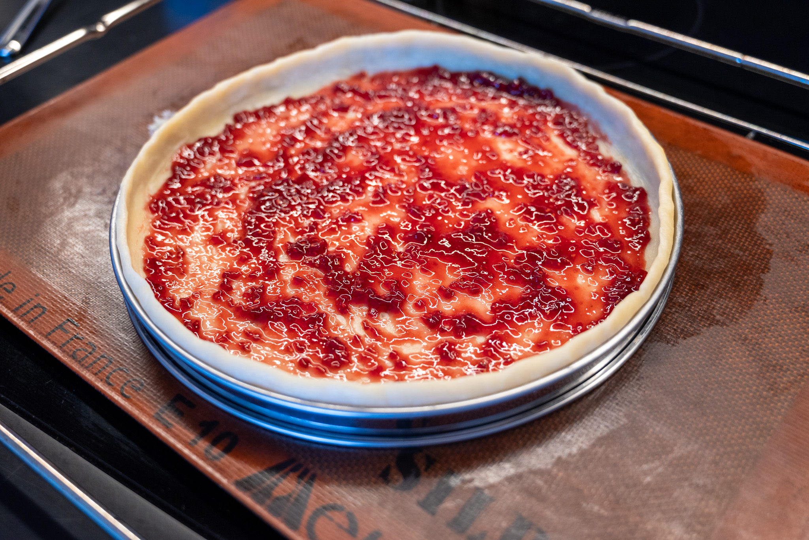

The almond filling will roughly double in volume in the oven, so don't worry that it doesn't completely fill the tart shell.

### Ingredients

#### For the filling

* 60 g unsalted butter, room temperature
* 50 g granulated sugar
* 50 g (about 1) egg
* 7 g amaretto (almond liqueur)
* 150 g almond flour
* 1 g salt

#### For the tart

* 350 g [pâte brisée](/recipes/pate-brisee)
* 40 g raspberry jam
* Filling from above
* 100 g (approximately) sliced blanched almonds
* Icing sugar

### Method

#### For the filling

In a stand mixer fitted with the paddle attachment, cream together the butter and sugar. Then add the egg, and continue to mix the filling until the egg is well-combined with the other ingredients.

Then add the liqueur, almond flour, and salt, and mix everything until the mixture is homogeneous.

Transfer the filling to a container and cover it tightly. Refrigerate it for at least 30 minutes before using it.

#### For the tart

Preheat an oven to 190 °C (375 °F) with fan (convection), if available.

Line a baking tray with a Silapt or parchment paper and center a 24 cm (9.5") tart ring on the prepared tray.

Roll out the pastry dough to approximately a 2 mm thickness, large enough for the tart ring. Drape the pastry dough over the ring, pushing the dough into the corners. Run a rolling pin over the rim of the tart ring to remove the excess dough. Using a fork, gently prick the base of the dough.

Using a small offset spatula, spread the jam into a thin layer in the bottom of the tart shell. Then add the almond filling and do the same. Sprinkle the top of the tart with the sliced almonds to generously cover the filling.

Transfer the tart to the oven and bake it until the tart shell is lightly golden, 30 to 35 minutes.

Remove the tart from the oven and dust it with icing sugar before serving.

