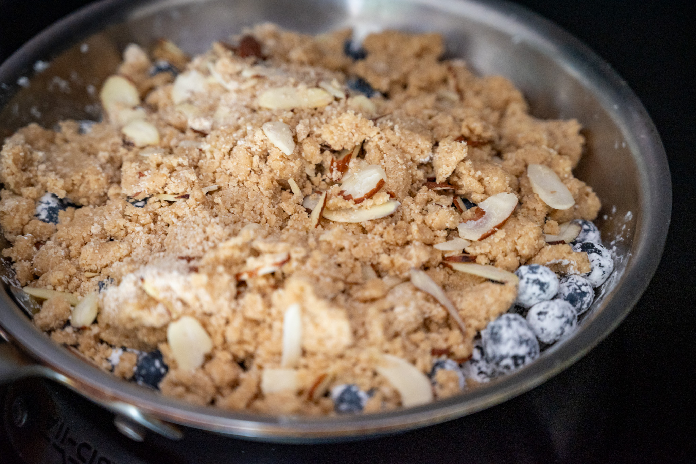

When I'm really pressed for time and need a summer dessert, something like this is my go-to. It's truly the work of minutes to throw together, and really takes advantage of great in-season blueberries. The flaked almonds add a nice bit of extra texture to what would otherwise be a pretty one-note dessert, especially if you're serving this with ice cream, custard, or crème fraîche.

### Ingredients

#### For the crumble topping

* 40 g sugar
* 180 g white whole wheat flour
* 4 g baking powder
* Pinch salt
* 120 g butter, cut into small cubes
* 40 g flaked almonds

#### For the assembled dish

* 560 g (two dry pints) fresh blueberries
* Zest of 1 lemon
* 30 g sugar
* 30 g cornflour
* Pinch salt

### Method

#### For the crumble topping

In a medium bowl, stir together the sugar, butter, flour, baking powder, and salt. Add the butter and rub it into the dry ingredients until a sandy, rough mixture has formed. Then add the flaked almonds and gently stir them into the mixture.

#### For the assembled dish

Preheat an oven to 170 °C (340 °F) with fan (convection), if available.

In a medium bowl, toss together the blueberries with the lemon zest, sugar, cornflour, and salt. Tumble that mixture into a small baking dish. Then spread the crumble topping over the berries.

Bake the crumble until the topping is lightly browned and the berries are bubbling, about 30 to 35 minutes. Allow the crumble to cool for at least 15 to 20 minutes before serving.
