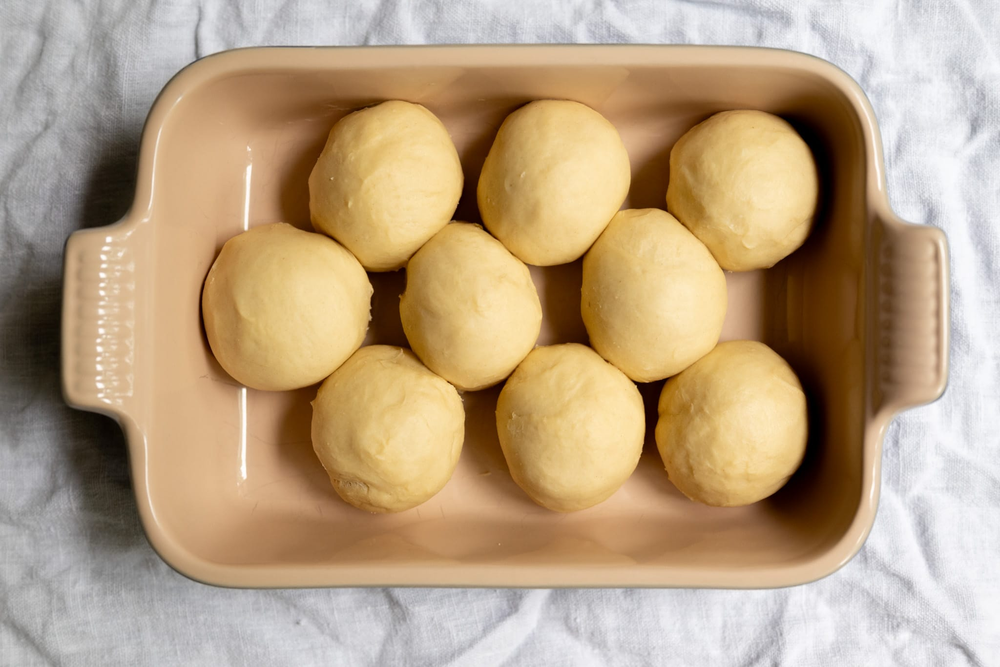

This is a great basic brioche recipe I've taken from my favorite YouTube channel on baking.

There are million different ways to take this dough and turn it into bread. I'll outline some here in the [method](#method) below, but this is hardly exhaustive.

A couple of other notes worth mentioning.

First, make sure to weigh out your eggs. This recipe will use about three. A gram or two either way of the specified amount won't do much harm. While it may feel weird if you're not used to it, if you're substantially out, it's going to cause problems.

Second, many people struggle with brioche dough because it can be tricky to incorporate the butter into the rest of the dough. It's important that the butter be at room temperature, around 20 °C (about 70 °F), and cut into reasonably small pieces.

Making a batch that's incorrectly sized will also make this difficult. If your stand mixer isn't meaningfully kneading the dough because it has too much or too little material to work with, it's going to be tricky to get the butter to incorporate correctly. For example, if I make the batch size much smaller than this in my KitchenAid "Professional" mixer with a 6 quart bowl, there really isn't enough material for the machine to get purchase.

### Ingredients

* 70 g granulated sugar
* 8 g instant yeast (15 g fresh yeast)
* 150 g eggs
* 150 g whole milk
* 500 g all-purpose flour
* 9 g salt
* 150 g unsalted butter, room temperature, cut into small cubes
* Egg, beaten

### Method

Pour the sugar, yeast, eggs, and milk in the bowl of a stand mixer fitted with a dough hook. Then add the flour.

Knead the dough on low speed for four minutes, until the mixture is homogeneous. Then increase the speed a notch and knead for a further six minutes. Add the butter and mix for another five minutes

Roughly shape the dough into a taught ball. Transfer the dough to a lightly greased airtight container. Let it rise at room temperature for 30 minutes, then transfer it to the refrigerator to rise for a further 12 to 18 hours. This is good to do overnight.

After the bulk fermentation, remove the dough from the refrigerator.

#### Easy brioche

Divide the dough into nine equal portions. Shape them into balls, tucking the dough under while turning to create a taught surface. Arrange the portions of dough in an alternating pattern in a high-sided baking dish.

Let the dough rise for about 90 minutes. Either cover the dough tightly, or place it in a cold oven (without turning on the heat) with a small bowl of boiling water. It should more or less fill out the tray when it's had enough of a final rise.

Preheat an oven to 150 °C (300 °F), with fan (convection) if that's available.

Gently brush the top of the risen brioche with the beaten egg (egg wash).

Bake the brioche for about 30 minutes, until it's nicely browned.

Let the brioche cool slightly in the baking tray, then transfer it to a cooling rack to cool to room temperature.
