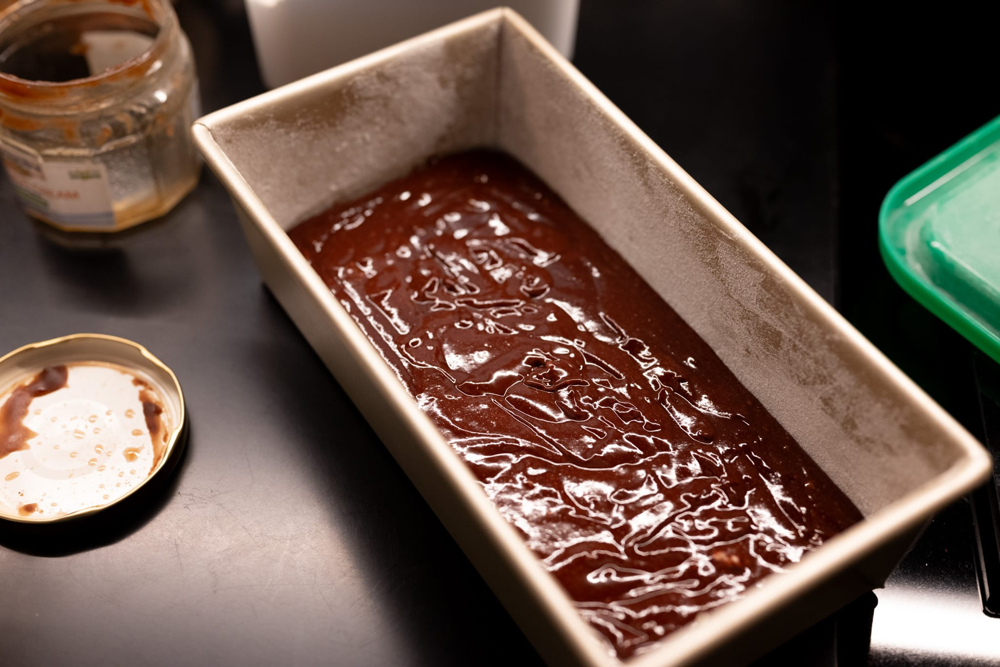

This is a paradoxical cake. It's pretty easy to make from a technical perspective, but the key ingredient --- the ingredient that makes the cake --- is very difficult to find here in the United States.

If you want to look for chestnut cream (_crème de marrons_), it's the best. Clément Faugier is probably the most popular and available brand. I've even seen it in the occasional US supermarket. Make sure to get "crème de marrons," which isn't necessarily the same thing as chestnut purée. _Crème de marrons_ is made from the "off-cuts" of candied chestnuts ("marrons glacés"), and has a lot of additional sugar, which you need for this cake.

In France, a "cake" (as opposed to a "gâteau") usually means baking in a loaf pan, like a pound cake. That's what I use here. Though this also works just fine in a round cake pan.

This is my personal transcription of a recipe via François-Régis Gaudry.

### Ingredients

* 200 g dark chocolate, roughly chopped
* 100 g unsalted butter
* 4 large eggs
* 500 g chestnut cream (crème de marrons)
* 2 large egg yolks
* 2 large egg whites

### Method

Butter and flour a cake pan.

Preheat an oven to 180 °C (350 °F) with fan (convection) if available.

In a saucepan over low heat, melt the chocolate. Then add the butter, and stir it into the chocolate to make a homogeneous, glossy mixture. Set the chocolate-butter mixture aside to let it cool slightly.

In a large bowl, whisk the eggs plus the two yolks together. Then add and whisk in the chestnut cream until the mixture is smooth and uniform.

Add the butter-chocolate mixture to the egg-chestnut mixture, and whisk to combine everything together.

Whip the egg whites to soft peaks. Gently fold the egg whites into the chocolate-chestnut mixture.

Pour the cake batter into the prepared cake pan.

Bake the cake until it's set and a cake tester comes out clean, about 40 minutes.
