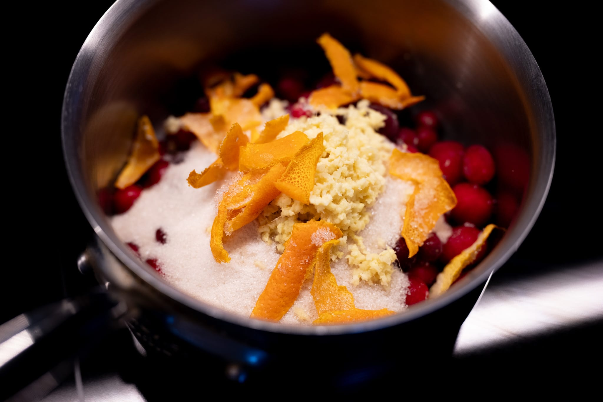

While a certain part of me feels the nostalgic draw of a can of wobbly cranberry sauce, once I had made and tried making a more grown up version, there was no going back. Especially because it's so easy to do.

This works with both fresh and frozen cranberries. I tend to prefer the frozen ones because they're more convenient, and there will be no discernible difference in the fished result.

I don't like the sauce to be overly sweet --- this is a meaningfully smaller amount of sugar than most recipes use. The salt also helps cut the bitterness of the cranberries.

### Ingredients

* 150 g sugar
* 50 g honey
* 500 g cranberries
* Zest of an orange
* 20 g grated ginger
* Salt

### Method

Combine the sugar and honey with half (250 g) the cranberries plus the orange zest and ginger in a medium saucepan. Place the pan over medium heat and bring everything to a simmer. Cook and stir the cranberries until they've broken down completely and started to gel. Then add the remaining cranberries and continue cooking them until the desired texture is obtained. Salt to taste.
