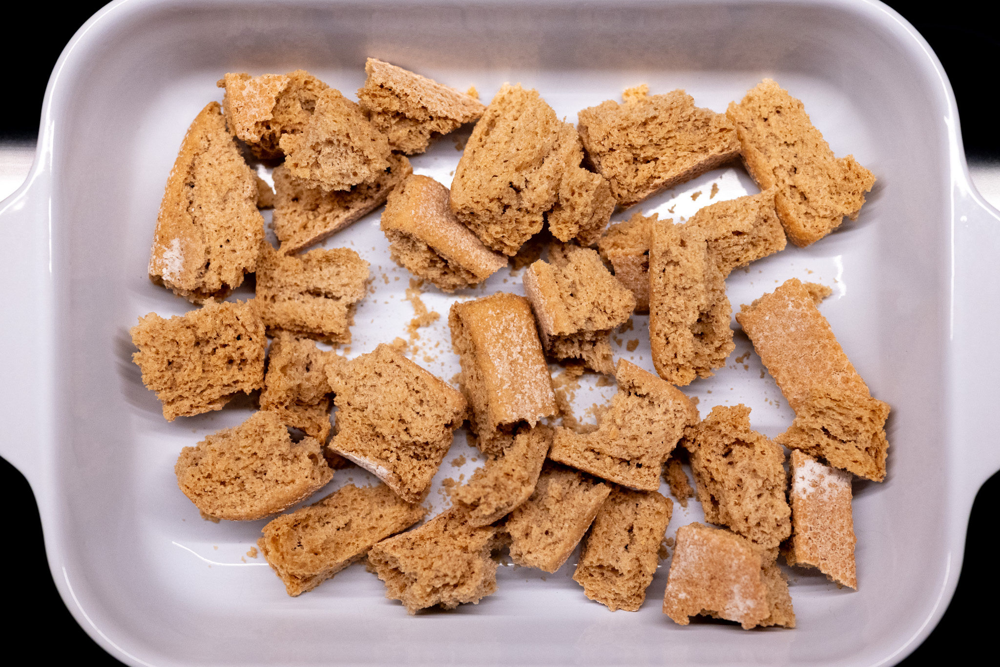
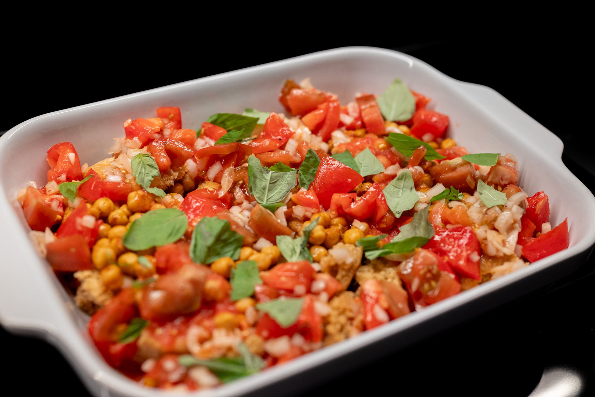

Credit where credit is due, this is something I saw at least 10 years ago when the inimitable Yotam Ottolenghi did a TV series on the islands of the Mediterranean. Through a bit of sleuthing, I managed to find a recording online, tried the recipe, and got something I thought was worth memorializing here.

Of course, it took me such a long time to try this because the bread used to make Cretan dakos, barley _paximathia_, aren't exactly something easy to find at the grocery store. It took a happy accident getting lunch one weekend at a local Greek fast casual chain to make this happen.

That said, I think this could also work with normal stale sourdough bread or something like a rye crispbread that's available in a lot of supermarkets.

Despite being baked, I do think getting great tomatoes makes a big difference here. I wouldn't make this outside the summer when you can get your hands on great ones.

### Ingredients

#### Paximathi

* 8-10 barley paximathi
* 30 g water
* 30 g red wine vinegar
* 30 g olive oil

#### Chickpeas

* 400 g cooked chickpeas
* Salt
* 15 g olive oil
* 1/8 teaspoon cinnamon
* 1/4 teaspoon paprika
* 1/4 teaspoon cumin
* 1/4 teaspoon turmeric
* 1/4 teaspoon dried oregano

#### Tomatoes

* 700 g (about 3) heirloom tomatoes, half grated, half roughly chopped
* 1/2 red onion, finely diced
* 1 clove garlic, finely minced
* Olive oil
* Salt

#### Garnish

* Fresh basil
* Greek yogurt
* Olive oil

### Method

Preheat an oven to 200 °C (400 °F).

Break the paximathi up into roughly bite-size chunks. Scatter them into a large, oven-safe baking dish.

Then roughly stir together the water, vinegar, and olive oil, and drizzle it evenly over the prepared paximathi to begin hydrating them.

Toss the chickpeas together with salt to taste, plus the 15 g of olive oil and herbs and spices. Pour the chickpeas over the paximathi in the baking tray.

Toss together the tomatoes, both chopped and grated, with the red onion and garlic, plus olive oil and salt to taste. Then tumble the tomatoes into the baking dish over the paximathi and chickpeas. Tear over a handful of basil leaves.

Transfer the baking dish to the preheated oven. Bake the dish for around 20-30 minutes. Everything should be warmed through. The paximathi should be softened, but still crisp in places.

Dollop Greek yogurt over the finished bake and drizzle over olive oil to taste.

Let the bake cool slightly and serve it lukewarm.
