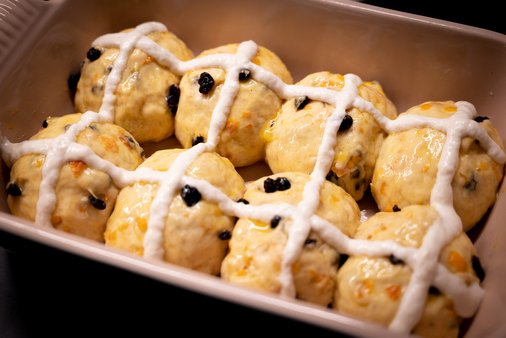

While I'm not at all religious, a few years ago I decided to embrace the ritual of making hot cross buns for Good Friday.

My remix of this Commonwealth classic is result of a cultural flub. When I was looking at other recipes, many called for a quantity of "mixed peel." Not having run across that ingredient before at the time, I took that very literally. Zest some lemons, oranges, and other citrus, and you have what the term appears to describe: a mix of peel.

As it turns out, "mixed peel" is in fact a specific kind of candied citrus peel. My initial instinct was the correct the potentially embarrassing misreading. But then I realized that I really liked my version. It makes for a hot cross bun that's intensely citrus-y, and much less cloying than one with all the additional sugar that using candied peel brings with it.

### Ingredients

* 200 g whole milk
* 3 cardamom pods, lightly crushed
* 1 stick cinnamon
* 2 whole cloves
* Pinch grated nutmeg
* 10 g active dry yeast
* 100 g unsalted butter, cold, cut into small cubes
* 450 g all-purpose flour
* 50 g sugar
* 2 g salt
* 2 g ground ginger
* 100 g (about 2) eggs, beaten
* 150 g dried currants
* 70 g blood orange zest, roughly chopped
* Egg, beaten
* All-purpose flour

### Method

Combine the milk with the cardamom, cinnamon, cloves, and nutmeg in a small saucepan. Heat it until warm, around 60 °C. Remove the pan from the heat and let the milk infuse for an hour. Strain the milk and discard the spices. Return the strained milk to a saucepan, and bring it just above room temperature, around 35 °C. Then add the yeast to bloom.

In the bowl of a stand mixer, combine the flour and butter. Mix the two until the butter has broken down into small pieces and the mixture is coarse and sandy. Then add the sugar, salt, ginger, eggs, and the milk-yeast mixture. Knead the dough in the stand mixer on a low speed until it is smooth and elastic, about 10 minutes.

Tip the kneaded dough onto a clean work surface. Lightly pat it out into a rectangle and scatter over the currants and orange zest. Knead the dough by hand until the currants and zest are well-distributed though the dough.

Lightly grease a large bowl. Fold the kneaded dough into a taught ball and place it in the prepared bowl. Tightly cover the bowl with plastic, and let it rise in a warm place until it's roughly doubled in volume. This should take about 1-3 hours.

Preheat an oven to 200 °C (400 °F).

Line a baking tray with a Silpat or parchment. Mix around 20 grams of all-purpose flour with enough water to form a thick paste with enough flow to pipe. Configure a piping bag with a small plain round tip, and add the flour-water mixture to the piping bag.

Gently deflate the risen dough and form it into 16 equally-sized buns and arrange them on the baking tray. Brush the buns with the beaten egg. Then add the crosses using the flour-water in the piping bag.

Bake the buns in the preheated oven until they are deeply golden, around 15-20 minutes.

Let the baked buns cool slightly in the tray, then transfer them to a cooling rack.