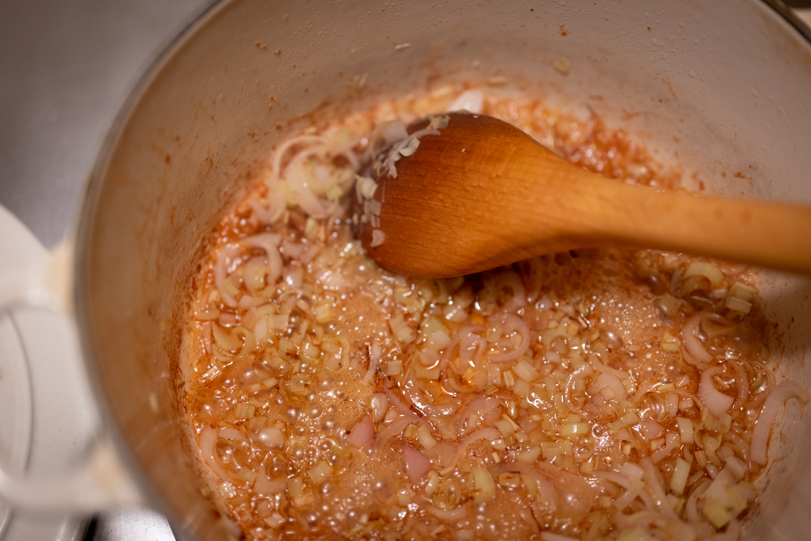

The Slanted Door, in San Francisco, is one of my favorite restaurants. Possibly the first time I ever ate there, many years ago, I ordered the lemongrass chicken, and I set about trying to recreate it. After several years trying to get it right against my taste memory, Charles Phan, who started the restaurant, published a recipe in [Vietnamese Home Cooking](https://www.penguinrandomhouse.com/books/209665/vietnamese-home-cooking-by-charles-phan/).

It turns out I got pretty close. While I could go back and adjust my memory, I've come to like the version I do for its simplicity.

#### On peanut butter

When I make this, I tend to be the eco-warrior I pretend I'm not and use real peanut butter. Mostly because that's what I buy, so that's what I have to hand. That is, peanut butter made only with peanuts and maybe salt. If I'm really honest with myself --- and if memory serves, this is also what Charles Phan recommends in his recipe --- it's probably better with the sugar and other additions from a peanut butter like Jif or Skippy.

On another level, everything at the Slanted Door is really a fusion of what I imagine is Vietnamese food as its currently cooked on the streets of Vietnam and the "Western" culinary tradition. It would not surprise me to learn that a street vendor would (obviously) not use Jif peanut butter, but instead toss in a bit of palm sugar (not exactly easy to find in the US) with the peanut butter.

#### On material

The best version of this dish would be made with a huge wok over super high-output restaurant-grade flame. It's important that the chicken doesn't steam, but stir fries, which means very high heat to drive water quickly off the surface. I don't have a gas cooker or a wok. If you do, you can do pretty well working in batches with the chicken. I use an enamel cast iron Dutch oven, and it works pretty well.

That said, this is a stir fry. In other words, it's truly critical to have everything ready to go when the cooking starts.

#### On lemongrass

If you've never worked with lemongrass before, a few points of advice. First, I generally remove the outermost layer. It's very fibrous and not very nice to eat. Second, most of the flavor in lemongrass --- or really any herb --- comes from crushing the cell walls of the plant. I like to bash the lemongrass with a rolling pin or a meat hammer before I chop it. This also makes the tough plant easier to work with.

### Ingredients

* 40 g chunky peanut butter
* 40 g fish sauce
* 40 g chicken stock
* Neutral oil (e.g., canola)
* 750 g (about 1.5 pounds) boneless, skinless chicken thighs, cut into bite-size pieces
* 3 shallots, thinly sliced
* 2 stalks lemongrass, finely chopped
* 40 mL mirin
* Spring onions, green parts only, roughly chopped (optional)
* Roasted unsalted peanuts, roughly chopped

### Method

In a small container, mix together the peanut butter, fish sauce, and chicken stock until it's a homogeneous, smooth sauce.

Heat a wok or large pan over very high heat. Add a thin film of oil. Depending on the size of the pan, brown the chicken pieces all at once or in batches. Remove the chicken from the pan once it's browned.

Reduce the heat to medium-high. Add more oil to the pan as necessary. Then add the shallots and lemongrass. Cook those until the lemongrass is fragrant and the shallots are very soft and beginning to brown at the edges. Add the mirin to deglaze the pan.

Add the chicken back to the pan. Then add the peanut butter sauce. Continue cooking the chicken until the sauce is thick, smooth, and glossy, about five minutes.

Garnish the chicken with the spring onions if desired and a dusting of chopped roasted peanuts.

