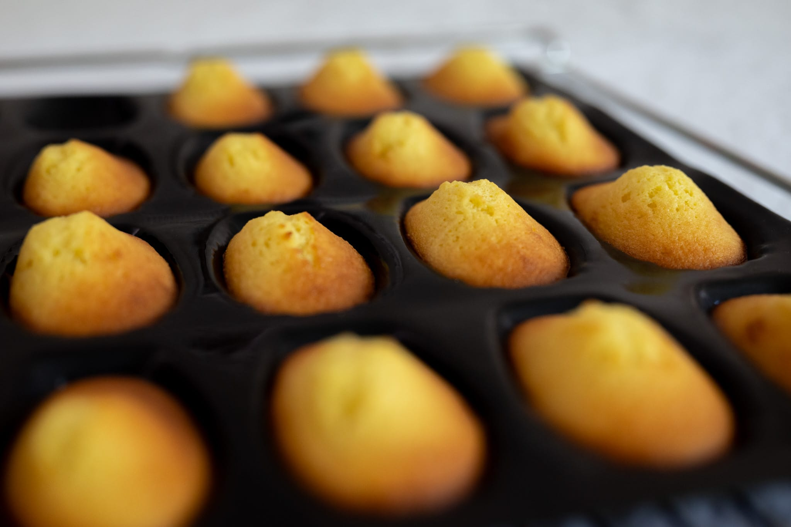

I spent years --- literally decades --- trying to figure out how to consistently bake great madeleines. 

Then, by pure luck, I found this [amazing blog, _Je pense donc je cuis_](https://jepensedoncjecuis.com/2022/09/reussissez-des-madeleines-moelleuses-et-bossues-a-tous-les-coups.html), that took a rigorous science-based approach to the cakes. It's in French, though I think Google Translate will do a good enough job if you're curious.

I'll summarize the key points here.

In my journey, the trickiest part of baking good madeleines was getting the characteristic hump they're supposed to have. A group of graduate students at the Université Paris Saclay went to the trouble of figuring out why and how this happens. As it turns out, the biggest determinants are mold shape and batter temperature.

In effect, you need the cakes to cook unevenly. First, you want the bottom part to rise and set, creating a base. This happens naturally as the mold is a far better conductor of heat than air once it's come up to temperature, which will happen because metal or silicone has a lower specific heat than the batter made mostly of water.

With this base formed, if the upper layer is still cool and thus relatively liquid, it can rise more on the base layer, creating the hump. If the upper layer is warmer, then it will set before it has an opportunity to expand.

It's also important to have relatively shallow sides for the molds. Molds with an angle of about 50° produced a hump, whereas straight-sided or even a 70° mold (like what you might use for financiers) didn't. My [Demarle Flexipan madeleine mold](https://www.sasademarle.com/store/flexible-molds/flexipan-origine/madeleines/) did the trick, and I imagine most other purpose-designed madeleine tins would as well.

From my own experimentation, there's also interplay between these factors. Using the recipe suggested on _Je pense donc je cuis_, I couldn't get nice consistent humps. Several batches later, I realized the batter was fine, but the oven wasn't quite hot enough.

#### Historical context

The madeleine is an odd case in the world of pastry. It's one of the few common desserts that's clearly named after a person, one assumes a French woman called Madeleine. Compare that to most others I can think of, which tend to be inspired by a resemblance to something clear (a _religieuse_ or rocky road ice cream), a place (Grasmere gingerbread, _biscotti di Prato_), an obviously notable person (omelette Arnold Bennett, the pavlova) or are simply self-describing (chocolate chip cookie, ginger snap).

Madeleines also demand a special mold. In my mind, you have to use a shell-shaped madeleine pan for something to be a madeleine. In the same way it would be strange to call something a cupcake if it were pyramid-shaped and the size of a watermelon.

The why behind these two traits are shrouded in mystery. The name is variously attributed to different notable people in French history. The shell shape is equally mysterious. Most stories tend to revolve around someone deciding to put the batter in a shell for fun.

Trying to bound these two questions has been tricky. It's an ongoing exercise.

Thus far, I've been able to establish a few firm facts.

The first mentions of the madeleine as a cake appear in the 18th century. There's a recipe for "Gateaux à la Madeleine" in the 1759 book _The Professed Cook_, published in London, translating recipes into English from French. Remarkably, the recipe looks a lot like the madeleines we'd recognize today. It calls for a 1:1 ratio of butter to flour, slightly less sugar by weight, and about the same ratio of eggs to that whole mixture. It also calls for citrus (orange flowers and lemon peel), like many madeleines today.

But this recipe doesn't make any sort of statement about the shape of the cakes. That is, there's no indication the madeleine, versus another small cake, needs to be in the shape of a shell.

Other recipes from the 18th and 19th century that I've been able to find are similar. As we might expect, the most obvious switch is the eventual move to using chemical leavening --- most modern recipes use baking powder --- once that became widely available through industrialization in the 19th century and broad distribution in the 20th. The other ingredient ratios remain more or less the same. There's no explicit mention of the shape, though.

At the other end of the historical timeline, the madeleine is perhaps most famously mentioned in the first chapter of Marcel Proust's _Du côté chez Swann_ ("Swann's Way"). Here, he mentions the fact they're often (or always) shell-shaped:

> Elle envoya chercher un de ces gâteaux courts et dodus appelés Petites Madeleines qui semblaient avoir été moulés dans la valve rainurée d’une coquille de Saint-Jacques.
>
> She sent for one of those short and plump cakes called Little Madeleines that looked like they had been molded in the grooved shell of a scallop.

In my reading, the novelty of the cake's shell shape is ambiguous. I can't tell if he's being descriptive for the sake of the prose, or mentioning the shape of the cakes because there would have been more than one kind of madeleine.

Either way, the first volume of _À la recherche du temps perdu_ (with the madeleine reference) was published in 1913. Which suggests the shell shape was at least relatively common by 1913.

Whereas the most proximate recipe I could find doesn't make any reference to the cake's shape. The handwritten notebooks of Georges Bachmmann, complied 1899 to 1902, contain several recipes for madeleines. None mentions how to bake the madeleines beyond one that suggests using a "hot oven."

Whether this means the shell shape was so common it didn't need to be mentioned is unclear. Most early cookbook authors assume a certain amount of skill on the part of the reader. Early recipes are often lists of ingredients with no instructions on putting them together at all. The authors assume you know how to make a sauce; all they need to provide are its contents. Likewise, most cooks wouldn't have had access to instruments to make more detailed instructions useful. Accurate clocks would not have been the province of most cooks until at least the mid-19th century. Most ovens didn't have thermostats until well into the 20th century. Even today, some recipes will include instructions for baking with a gas mark in addition to a precise temperature.

With this in mind, it's difficult to make a statement about our understanding of what it means for a cake to be a madeleine. It's possible the shell shape was accepted practice for decades or centuries, to the point Georges Bachmann took it as a given people would find a shell or shell-shaped mold to follow the recipes. It's equally possible the shell shape --- like a lot of other food traditions we think go back further in time --- didn't really become part of the madeleine's identity until the 20th century. My first encounter with madeleines came via Julia Child's 1989 cookbook _The Way to Cook_, by which point is is clear that madeleine means shell-shaped.

I'll continue updating this as I discover more.

### Ingredients

* 90 g unsalted butter
* 15 g honey
* 100 g (about 2) eggs
* 75 g sugar
* 90 g all-purpose flour
* 4 g baking powder
* 15 g whole milk
* 5 g vanilla extract
* Pinch salt

### Method

Melt the butter in a small saucepan. Then stir in the honey. Let this mixture cool until it's still liquid but no longer warm.

In a large bowl, whisk together the eggs and sugar until the mixture is foamy and has lightened in color.

Then add the flour and baking powder, and to just combine the wet and dry ingredients. Follow that with the cooled butter-honey mixture, the milk, vanilla extract, and salt. Whisk together to form a homogeneous mixture.

Cover the bowl and refrigerate it for at least two hours, up to overnight.

Preheat an oven to 200 °C (400 °F) with fan assist (convection) if available.

If you're using a metal madeleine tin, brush it with melted butter and dust the tin with flour to prevent sticking.

Spoon or pipe approximately 25 g of the batter into each shell. There should be about 5 mm (around 3/16") between the top of the mold and the batter. Return the bowl with the batter to the refrigerator to keep it cool if you need to bake the madeleines in more than one batch.

Transfer the pan to the oven and let the madeleines bake for about 10 minutes. They should be well-browned and risen.

Either flip each madeleine over in the pan and let them cool there, or, if you want to bake another batch immediately, transfer them to a cooling rack.

Serve the madeleines immediately if possible. Store in an airtight container and reheat in a medium (ca. 180 °C) oven to serve.

### Variations

#### Lemon madeleines

Substitute 15 g of lemon juice and the zest of a whole lemon for the whole milk and vanilla extract.
