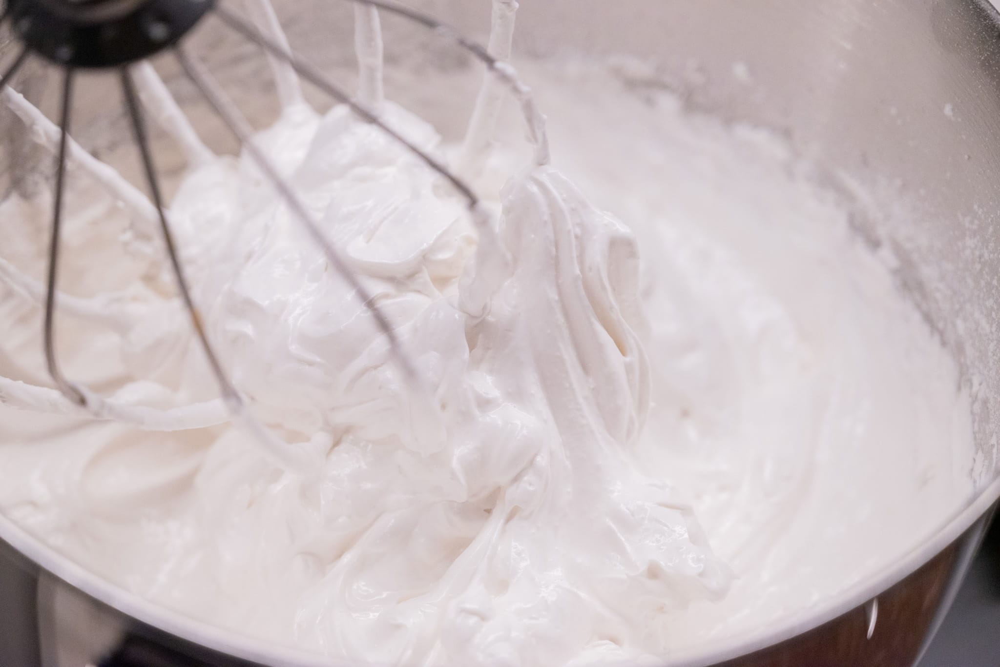

If you've got good fruit, a pavlova is a great way to turn it into a slightly more showy dessert. On the surface, it's a meringue with fruit and whipped cream on top.

But I'm of the school of thought that a pavlova meringue should be crisp on the outside and gooey on the inside. That requires a slightly modified meringue recipe, one that includes corn starch. The starches help hold onto moisture that would otherwise bake out.

This recipe uses what might seem like a lot of sugar. Because it is a lot of sugar. For better or worse, you need to use this ratio of sugar to egg whites at a minimum to give the mixture enough stability to hold.

### Ingredients

* 120 g (about four) egg whites
* 200 g sugar
* 6 g corn starch (cornflour)
* 100 g cream

### Method

Pour the egg whites in the bowl of a stand mixer fitted with its whisk attachment.

Whip the egg whites on a medium speed until they're frothy. Then raise the speed of the mixer to high, and whip the egg whites to stiff peaks. With the mixer still on high speed, slowly pour in the sugar. Then add in the corn flour.

The mixture should be extremely stiff and glossy.

Preheat an oven to 120 °C with fan (convection), if available.

Line a baking tray with a Silpat or parchment paper. Pour out the meringue mixture onto the lined baking tray. Spread the mixture into a roughly circular shape and make a gentle well in the center of the disc.

Bake the meringue for 10 minutes. Then drop the oven temperature to 100 °C. Bake the meringue for a further hour. Then slightly prop open the oven and let the meringue continue to dry out. Let the meringue dry out for 2-3 hours minimum.

Whip the cream to soft peaks.

For final assembly, pour the whipped cream into the center of the meringue shell, and then top with fruit.

### Variations

#### Peach 

* 300 g peaches, peeled, halved, stones removed, each half cut into 2-4 slices
* 30 g sugar

Toss the peaches with the sugar in a medium bowl. Let the peaches macerate for 20 to 30 minutes until they've softened and firmed slightly.

#### Strawberry

* 300 g [gin macerated strawberries](/recipes/gin-macerated-strawberries/)
