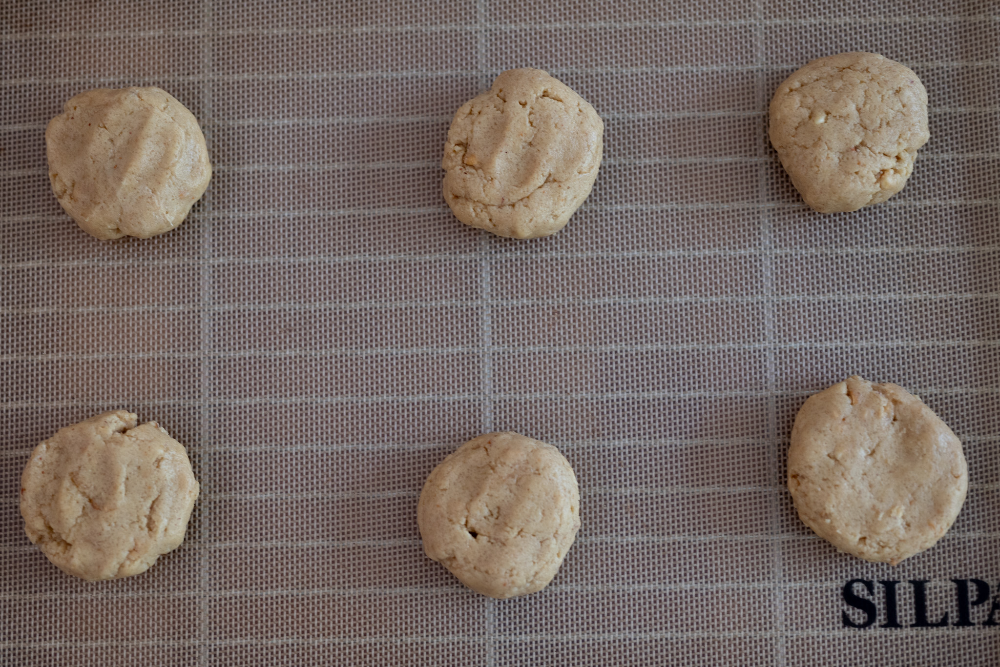

I first had miso in a dessert at a restaurant in Portland called Biwa, I want to say in an ice cream. While I grew up eating and liking miso, it wasn't ever something you'd add to a dessert. And yet, it really works. Not in adding any sort of funk, but simply to add an almost indescribable complexity that makes the peanut butter taste even more of peanut butter.

### Ingredients

* 100 g unsalted butter, room temperature
* 130 g chunky peanut butter
* 40 g white miso
* 90 g brown sugar
* 80 g granulated sugar
* 50 g (about 1) egg
* 5 g baking soda
* 175 g all-purpose flour

### Method

Fit a stand mixer with its paddle attachment. Add the butter, peanut butter, miso, and sugars to the bowl. Then cream together the wet ingredients on medium speed. The mixture should be lighter and fluffy.

Then add the egg, and mix it in on low speed until just integrated into the dough.

Add the baking soda and flour. Mix again on low speed until just combined.

Cover the bowl and move it to the refrigerator for at least 20 minutes, up to 12 hours.

Preheat an oven to 160 °C (325 °F).

For each cookie, take a roughly 30 g portion, roll it into a ball and gently flatten into a thick round. Place the cookies on a Silpat or sheet of parchment paper.

Bake the cookies for about 10 minutes, until they're just set.

Transfer the Silpats or sheets of parchment with the cookies onto a wire cooling rack, and let the cookies cool to room temperature before serving. Store them in an airtight container for up to three days.