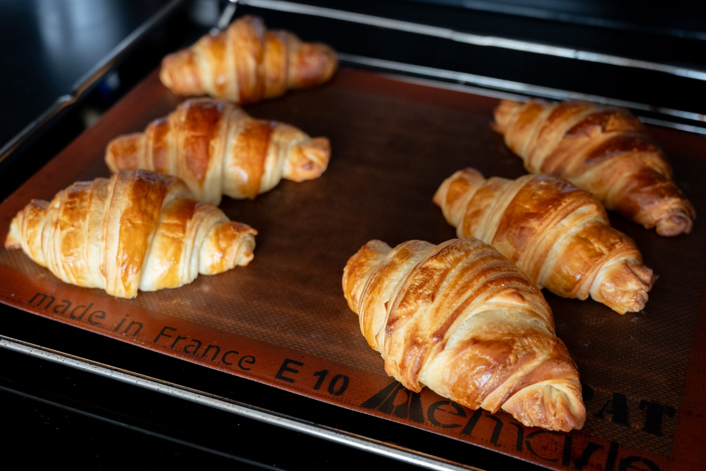

This is the dough to make _viennoiserie_, risen buttery concoctions like croissants and pains au chocolat. It's incredibly fiddly to say the least.

One essential step: get the best --- by which I mean highest fat content --- butter you can find. Kerrygold is widely available in the US, and is a good option.

It's also critical that you weigh out the ingredients and work with precision. It may look strange to see a measurement like 10 grams of egg, but that is not a mistake. Use a whole egg (about 50 g) and this won't work very well. Likewise, this is one case where trying to get everything to be uniform and angles as close to 90° as possible will do you favors. The more robotic you can be, the better the results.

If you're in the habit of making PLF somewhat regularly, adding the scraps and trimmings from a previous batch will improve the dough's flavor and malleability as well as cutting down on waste.

### Special equipment

* Ruler or measuring tape

### Ingredients

* 10 g egg
* 50 g whole milk (do not use non-dairy alternative)
* 50 g water
* 4 g instant yeast (8 g fresh yeast)
* 100 g bread flour
* 100 g all-purpose flour
* 4 g salt
* 30 g sugar
* Pâte fermentée (optional)
* 100 g unsalted butter
* Egg, for the glaze

### Method

Pour the wet ingredients (egg, milk, water, yeast) into the bowl of a stand mixer. Then add the dry ingredients: the flours, salt, and sugar. If you have any leftover dough from a previous batch (pâte fermentée), add that as well.

Mix on the lowest speed until the dough is combined and homogeneous. Then increase the speed to the next highest setting and knead until the dough is smooth and elastic, about 6 minutes.

Roll the dough into a roughly 20 by 26 cm (8 by 10 inch) rectangle, taking care to make it as rectangular as possible. Tightly cover the dough with plastic, then place it in the refrigerator for at least 12 hours. This is great to do the night before.

When the dough has finished resting, place the butter between sheets of baking paper and gently pound it into a thin rectangle about 18 by 13 cm (7 by 5 inches). It should be approximately the same height as the dough and about half the width so it can be encased.

Place the butter in the center of the dough sheet, and then fold the left and right sides of the dough over to encase the butter. The dough should just touch and not overlap. Then with a rolling pin, gently push to seal the butter inside. Roll the dough out perpendicular to the seam. It should be about 50 cm (20 inches) and about 3 mm (about 1/8 inch) thick.

Now complete the first turn. With the long side of the dough parallel to your body, fold a few centimeters from the left over, and then fold from the other side to meet it. Fold this in half again, and gently press it together to seal with a rolling pin. Using a baker's lame or sharp knife, slit the dough at each of the three folds. Wrap the dough in plastic again, and refrigerate it for about 45 minutes to let the butter firm back up.

After resting, roll the dough out to about 50 cm (20 inches) in length again. Do the second turn: fold about a third of the sheet in toward the center and fold the other side of the sheet over the top. You should have three layers. Press the dough gently together with a rolling pin to seal it. Use the baker's lame or sharp kinfe to slit each of the folds. Cover the dough in plastic again for a further 60 minutes in the refrigerator.

Remove the dough from the refrigerator. Roll out the dough to about 25 by 25 cm (10 by 10 inches).

### Croissants

Divide the square into three equal strips. Then divide each of those along the diagonal to make two triangles, giving six overall. Roll those from the wide end towards you, making the characteristic croissant shape. (For curved croissants cut a roughly 1 cm slit along the long side perpendicular.) Lay those seam side down onto a lined baking tray.

Brush with egg, cover, and allow to rise for 2.5 hours.

Preheat an oven to 180 °C (350 °F). Bake the risen croissants for about 15 minutes, or until they're golden brown. Remove them from the oven and let them cool to room temperature on a wire rack before serving them.

