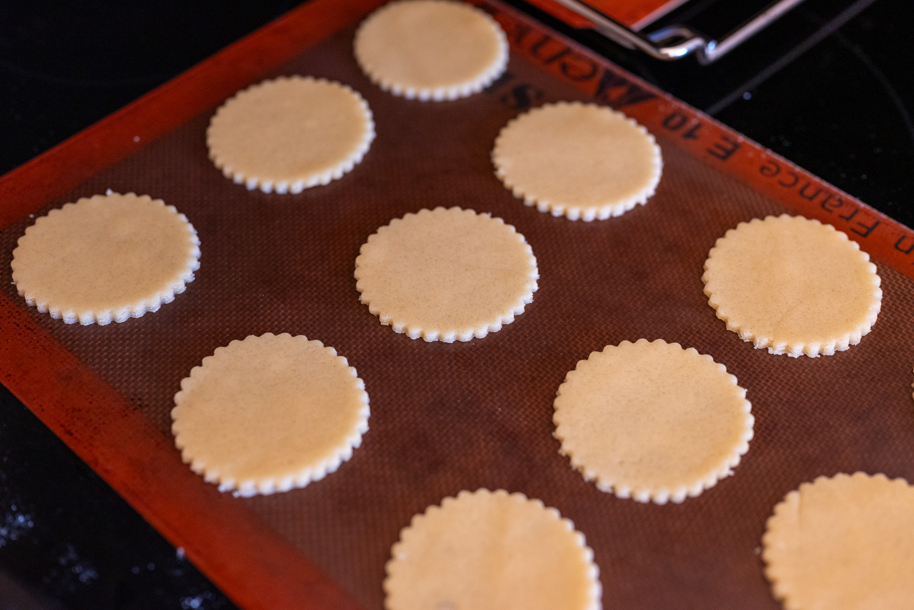

This is a favorite little biscuit from the wonderful people at [Poilâne](https://www.poilane.com).

The ingredients list is minimal, they're really easy to make, and they taste great.

You can really use any cutter you like. I would recommend against anything too complicated or using too many different shapes, which could create problems since the biscuits will bake at different speeds. For the most true-to-the-original results, use a round fluted cutter.

### Ingredients

* 225 g unsalted butter, cubed and softened
* 250 g granulated sugar
* 1.5 g sea salt
* 1 large egg plus 1 large egg yolk
* 500 g all-purpose flour

### Method

Cream together the butter, sugar, and salt in a stand mixer fitted with a paddle attachment. Add the eggs, and continue mixing until just combined. Then gradually add the flour and mix until the dough barely forms.

Divide the dough in half and form each half into a flat disk. Wrap the disks in plastic film. Refrigerate the dough for at least 60 minutes, up to two days.

Preheat an oven to 180 °C (350 °F) with fan (convection) if available.

Line several baking sheets with Silpats or parchment paper.

On a lightly floured surface, roll each portion of dough out to a 3-4 mm thickness. Using a 5-6 cm diameter round cutter (preferably fluted), cut out biscuits and arrange them on the prepared baking sheets. Leave about 1 cm between each biscuit.

Transfer the baking sheets to the oven, and bake the biscuits for 12 to 15 minutes. They should be matte in appearance and lightly browned around the edges.

Transfer the Silpats to wire cooling racks and let the biscuits cool completely.
