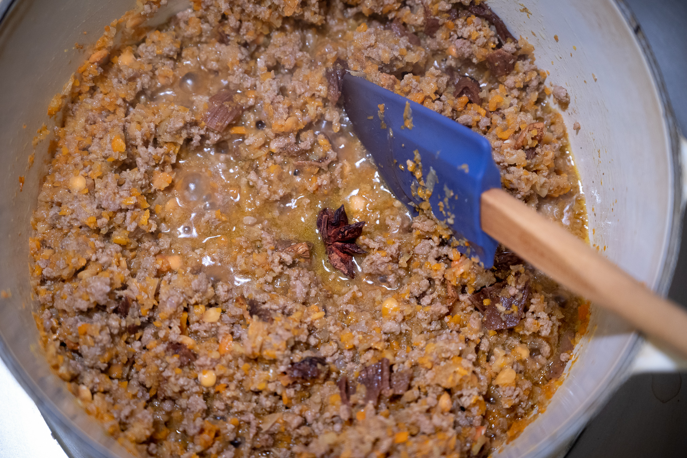
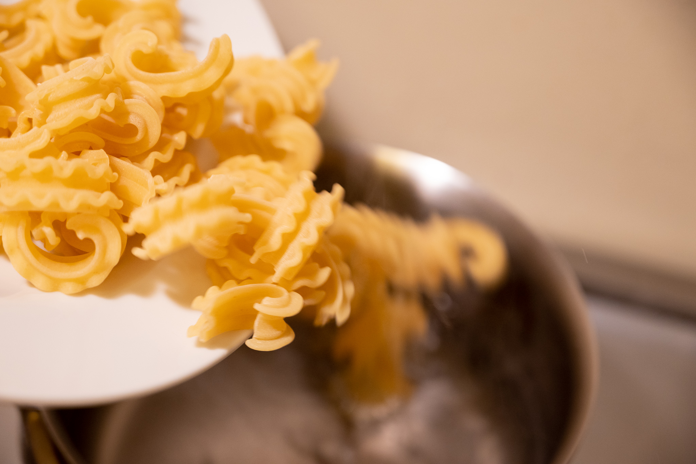

This is one of those dishes that's ubiquitous and still manages to raise the hackles of purists. I would argue that the purity tests around the _ragù alla bolognese_ are unfounded. Yes, fine, there is an organization in Bologna (or maybe in Emilia-Romagna) that has tried to codify the "real" _ragù_ recipe. But like so many regional dishes, everyone has their own variation.

The dish is and has always been evolving. Consider: we can dispute the precise contours of the recipe, but most people would agree that on some level it's a tomato-based sauce. Then consider that tomatoes aren't native to Italy. They were imported from South America by European explorers and were valued more for their decorative potential until the 19th century.

Riffing on ideas from food science research, I like to spike mine with star anise. The aniseed flavor amplifies the umami in the meat, mushrooms, and tomatoes. But it's a subtle enough flavor --- definitely prefer the whole spice for that reason --- not to dominate the dish.

My version here may not be the "best" --- certainly it's not the absolute most complicated or complexly flavored --- but it gets the job done, and it doesn't disappoint.

In Bologna, the sauce is usually served with flat, thick noodles like tagliatelle. Putting aside questions of tradition, from an engineering standpoint this is obviously a better choice than spaghetti. This is a thick, chunky sauce: you want something that can pick it up. If tagliatelle are too hard to find or too much work to make from scratch, I like using something like rigatoni. Or, if you can get your hands on a box, the much-vaunted cascatelli from Sfoglini is also excellent.

### Ingredients

* Olive oil
* 1 medium onion, very finely chopped
* 1 medium carrot, very finely chopped
* 2 sticks celery, very finely chopped
* 150 g ground beef (preferably 85% lean or less)
* 150 g ground pork
* 150 mL whole milk
* 150 mL medium-bodied red wine
* 1 star anise
* 1 bay leaf
* 5 g dried porcini mushrooms, re-hydrated, finely chopped, liquid strained and reserved
* 150 g concentrated tomato paste
* Salt

### Method

Heat a film of olive oil over medium heat. Then, add the onion, carrot, and celery with a pinch of salt. Cook the aromatics until they're very soft, the onions are translucent, but they are not burnt, about 10 to 15 minutes.

Then add the ground beef and pork, followed immediately by the milk. Use a spoon or spatula to break up the meat. Keep the heat on medium and cook the sauce until all the liquid has evaporated and the mixture begins to sizzle.

Add the wine plus the star anise and bay, and cook it until most of the liquid has evaporated and it no longer smells of alcohol. Then add the re-hydrated mushrooms and the strained liquid. Cook that down until the pan is one again fairly dry.

Make a space in the pan and add more olive oil, followed by the tomato paste. Cook and fry the tomato paste until it's a deep rust color. Then stir the tomato through the rest of the sauce. Add some of the water from cooking the pasta to dilute the sauce. It should be loose, but not watery. Then season to taste with salt. Remove and discard the star anise and bay. Serve immediately.
